# Aleksandra Makarets - photographer

The Photographer's portfolio website is a visually captivating and professionally designed platform aimed at showcasing the photographer's creative work and talent in lifestyle and travel lifestyle photography. With a focus on delivering a seamless user experience, this website offers visitors a glimpse into the photographer's unique style, storytelling approach, and passion for capturing memorable moments.

Tailored to appeal to potential clients, collaborators, and photography enthusiasts alike, this website offers a captivating glimpse into the photographer's creative vision and storytelling prowess.

 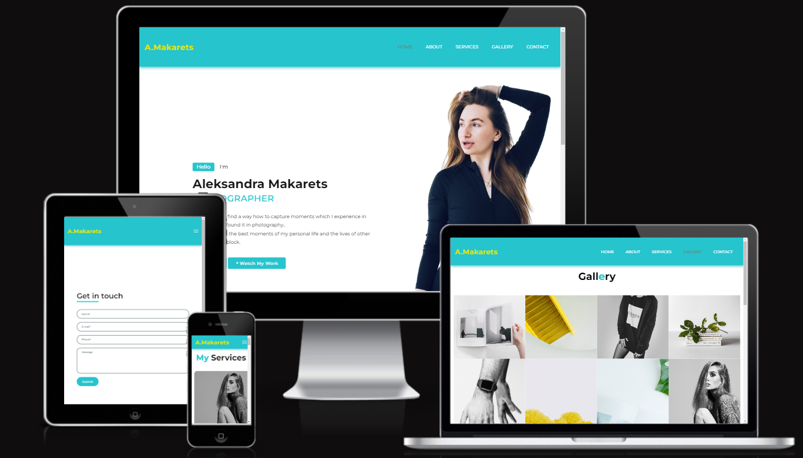

 ## Features

### Existing Features

- __Navigation Bar__

  - Featured on the top of the page, the navigation shows the photographer's name in the left corner: A.Makarets that links to the top of the page.
  - The other navigation links are to the right: About, Servises, Gallery and Contact which link to different pages of the website.
  - This section will allow the user to easily navigate from page to page across all devices without having to revert back to the previous page via the ‘back’ button.
  
  
- __The landing page and image__
 - The main page shows the name of the photographer and a friendly introduction to the visitors of the site.
  - It contains the author's personal opinions about his site and two buttons "Hire me" and "View my works" are located so that the user can quickly find the necessary section when researching the site.
  - The photo of the photographer is placed on the right, so that visitors feel as if the photographer is next to them and is talking about himself. It is hidden on phone-sized screens.
  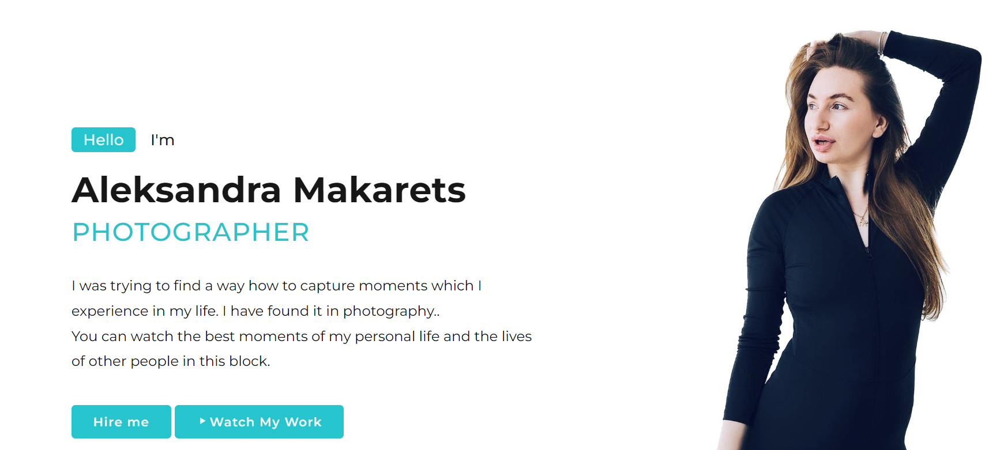

- __Some numbers section__

  - The section some numbers allows visitors to see how much experience the photographer has at this time.
  - The section contains data on the number of photoshoots, how many models, locations and countries there were.
  - This section will be updated as the data changes to keep the user up to date.

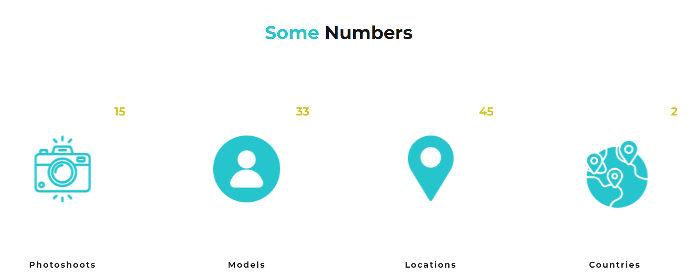

- __Footer section__

  - The footer section includes links to the relevant social media sites for Aleksandra Makarets. The links will open to a new tab to allow easy navigation for the user.
  - The footer also contains a site navigation panel and the photographer's contact information.
  - The footer is valuable to the user as it encourages them to keep connected via social media.

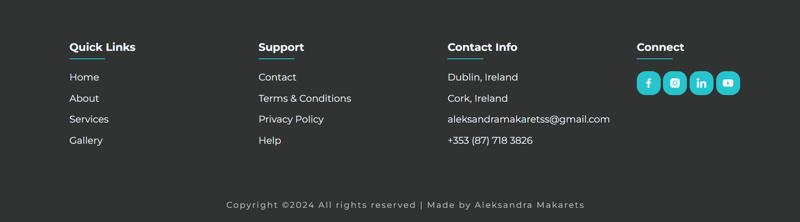

- __About section__

  - In the About section, users can get to know the photographer better and understand why she does this work.

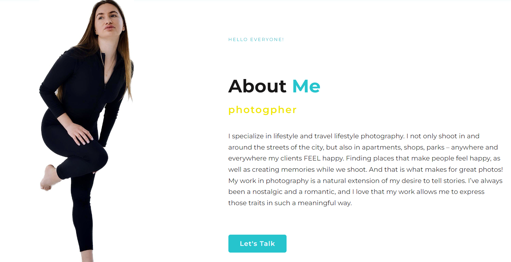
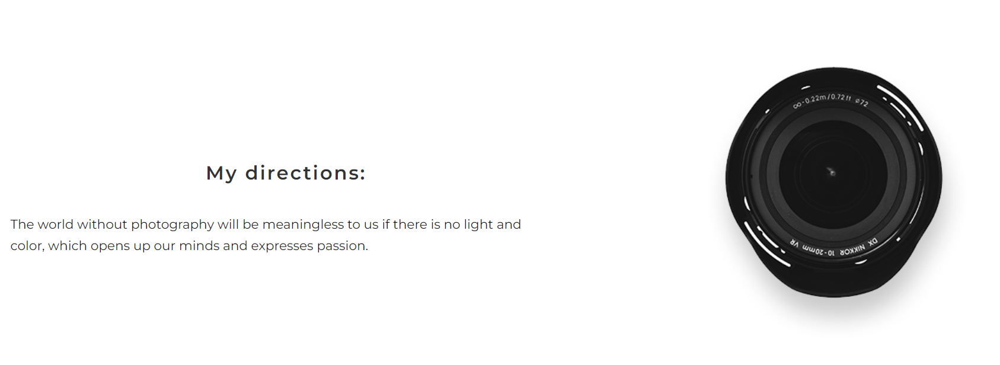

- __Servises section__

  - This is one of the most important pages of the website, here the user can learn about all types of services provided by the photographer.
  - Servises includes: portraits, creative, family memories, love story, fashion and street photo.
  - The services are immediately demonstrated on the photo of the photographer, so the user can see what a different kind of photo session means.
  
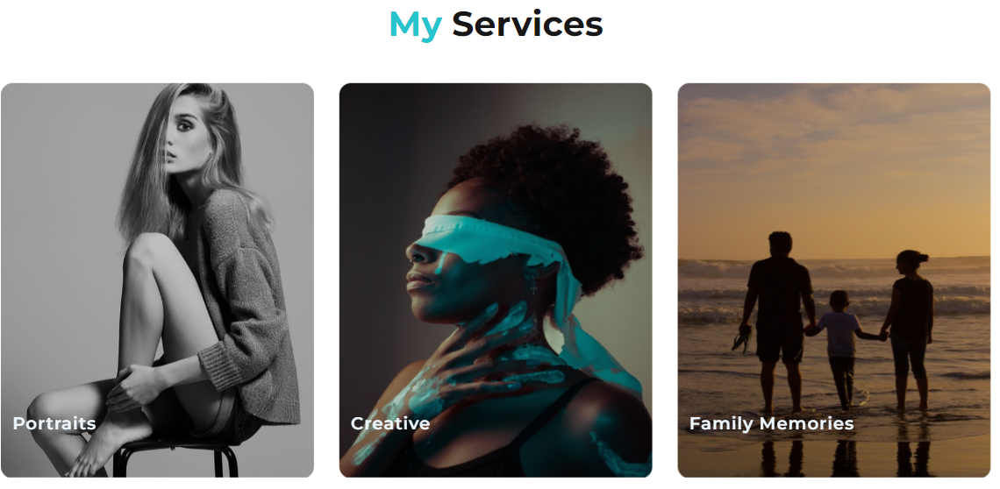

- __Offets and price section__

  - Package offers are clearly described here, which the client can choose when ordering an offer.
  - Website users are shown three packages: Minimum, Standard and Premium.
   They differ in price, number of photos and locations.
  - In order for the user to immediately choose a suitable package, there is a purchase button at the bottom.
  
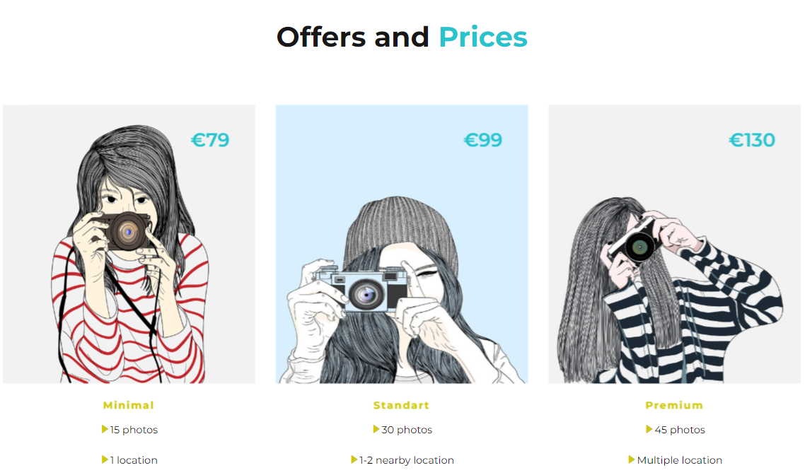

- __Gallery section__

  - The gallery will provide the user with supporting images to see what the photoshoots look like.
  - This section is valuable to the user as he will be able to easily identify the types of photoshoots the photographer is doing.
  
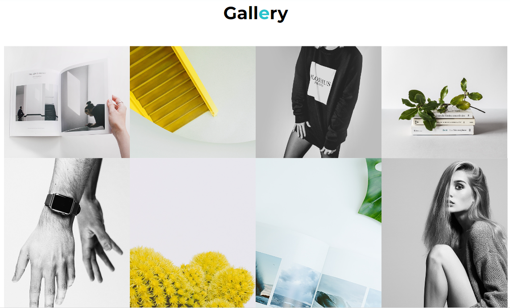

- __Contact section__

  - In the "Contacts" section, the user can leave his data to contact him and discuss the photoshoot or answer questions.
  - The user will be asked to submit their full name and email address and phone number.
  - Users are also offered a text entry field where they can write their wishes or describe their dream photo shoot.
  - The page is decorated with an image of a camera, which perfectly emphasizes the minimalist style of this site.
  
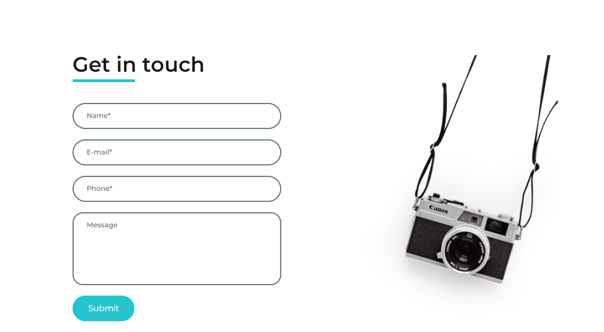

### Features Left to Implement

- __Quick form of payment on the website through well-known payment systems of the world.__

## UX

- There are two broad groups of users targeted at this website. The first group is individuals, which include: models, actors, families, couples in love, ordinary people. The second large group is companies that include: professional branding people, large and small business companies, advertising and marketing agencies.
- The site is focused on simplicity and ease of navigation according to the main directions of the user's attention in the gallery of the photographer's works and the possibility to contact him.

## User Stories

- As the developer of this site, I aim to provide users with access to all information about the photographer and his portfolio. And also help the photographer quickly find new clients.I came up with the following points, which are applicable to the users:
  - As a potential client, I want to easily navigate through the photographer's portfolio to view samples of their work and assess their photography style.
  - As a photography enthusiast, I want to learn more about the photographer's background, experience, and creative process to gain insights and inspiration.
  - As a prospective collaborator or partner, I want to read testimonials or client reviews to evaluate the photographer's professionalism, reliability, and quality of work.
  - As a visitor interested in booking a session, I want to find clear contact information and a user-friendly contact form to inquire about services, availability, and pricing.
  - As a returning visitor, I want to explore new blog posts or updates to stay informed about the photographer's recent projects, events, or promotions.
  - As a mobile user, I want the website to be responsive and optimized for smaller screens, ensuring a seamless browsing experience on my smartphone or tablet.
  - As a visitor looking for specific types of photography, I want to use filters or categories to narrow down the portfolio and find projects that match my interests or preferences.

   ## Testing

- I tested that this website works in different browsers: Chrome, Opera, Safari.
- On mobile devices, I tested the my site on a Samsung Galaxy A33 5G a with the Samsung browser and an iPhone 12Pro with the Safari browser.
- I confirmed that this project is responsive, looks good and functions on all standard screen sizes using the devtools device toolbar.
- I confirmed that navigation, home, about, servises, gallery, and contact text are all readable and easy to understand.
- I have confirmed that the form works: requires in every field, will only accept an emailin the email field, and the submit button works.
- Using accessibility tools (e.g., screen readers, keyboard navigation) confirms that the website is accessible, with alt text provided for images and proper HTML semantics implemented for improved accessibility.
- The gallery grid displays thumbnail images of photography projects in a visually appealing layout, allowing visitors to browse through the photographer's work effortlessly.

- __HTML__ No errors found for all pages using the [W3C validator.](https://validator.w3.org/#validate_by_input) 
   - [Home page](media/indexchecker.png)
   - [About page](media/aboutchcker.png)
   - [Servises page](media/serviseschecker.png)
   - [Gallery page](media/gallerychecker.png)
   - [Contact page](media/contactchecker.png)
  
- __CSS__  No errors were found when passing through the official [(Jigsaw) validator](https://jigsaw.w3.org/css-validator/validator.html.en)
    - [Home page](media/indexvalidator.png)
    - [About page](media/aboutvalidator.png)
    - [Servises page](media/servisesvalidator.png)
    - [Gallery page](media/galleryvalidator.png)
    - [Contact page](media/contactsvalidator.png)
- __Accessibility__   I confirmed that the colors and fonts chosen are easy to read and accessible by running it through [Lighthouse DevTools](media/lighthouse.png)

### Bugs

#### Solved bugs
  
1. The coding sequence was broken, the parent tag had incorrect child tags. This error was in the navigation bar, which is why the errors were on every page of the site.
    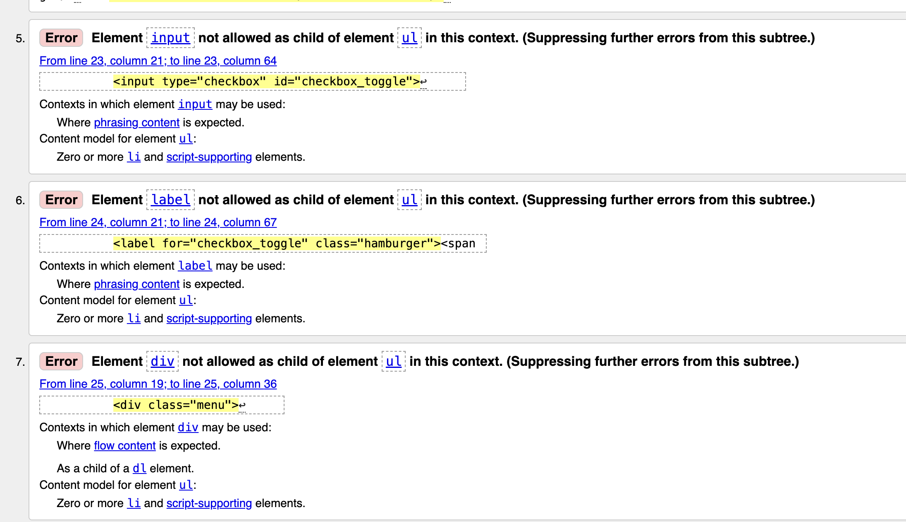
  - I refactored this code, then wrote down the correct tags for all elements./ fixed the problem.
2. File naming for multiple images is broken.
    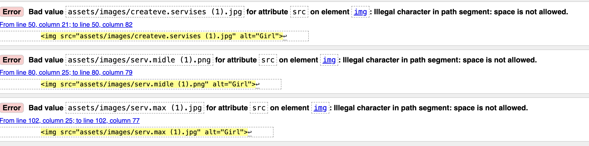
  - Renamed the files in accordance with the standard./ fixed the problem.
3.  There were invalid or empty attributes to the input element on the contact page.
    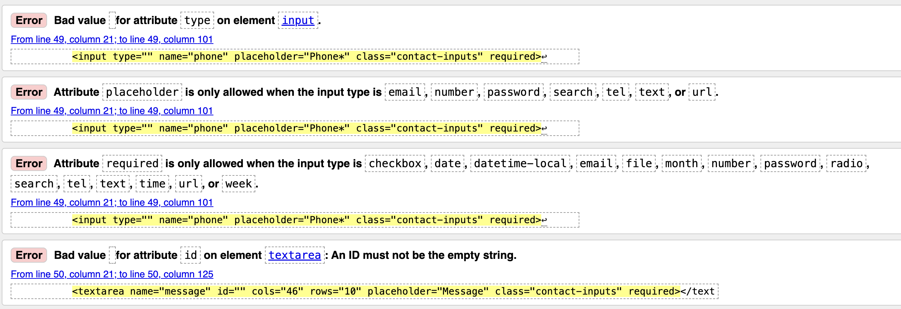
  - Fixed the problem.
4. There were missing comments for individual code blocks and sections, both in the HTML file and in the CSS
  - Added comments according to code blocks.

  
### Unfixed Bugs

- No unfixed bugs.
